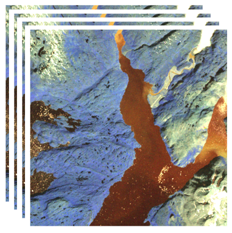

# GMM on Hypespectral images
Gausian Mixture Models applied on Hyperspectral Satellite images to automatically extract vegetation, the sea and cities

-----------------------------------
# Hyperspectral imagery
Optical-, multi-, and hyper-spectral sensors are all measuring the intensity of electromagnetic waves reflected by a target's surface in each spectral band available to the sensor. These bands are often measuring reflections from the ultraviolet (100-400nm) to the near infrared (750-1400 nm) electromagnetic regions, and even to 2500nm. By comparing the measured spectral signature with the source incident spectra, it is possible to derive the physical and chemical properties of the target. Water, sea ice, chlorophyll, basalt rocks, diorite rocks  etc. have widely different spectra, meaning a distinction of not only the individual targets is possible, but also their conditions. Optical sensors measures the intensity in three bands; red, green and blue whereas multi-spectral sensors measures the intensity in tens of bands and hyper-spectral sensor in hundreds of bands. For instance, Chlorophyll has a high intensity in the near infrared(NIR) band and low intensity in the red band, whereas water has a high intensity in the blue band with low intensity in both red and NIR. It is consequently possible to distinguish between water with and without high concentrations of chlorophyll using a multi- or hyper-spectral sensor. Similartly, using e.g. a hyper/spectral sensor, it is possible to distinguish between different kinds of rocks, and even gold (if it is on the surface). The most common source of illumination is the sun, and when available, the sensors can measure a reflection in the entire optical spectrum.

Below, an image taken from the aviris sensor is shown (or, 3 bands..) This will be used to illustrated 2 unsupervised methods of working with hyperspectral data

----------------------------------
# Unsupervised classification

"Unsupervised learning (UL) is a type of algorithm that learns patterns from untagged data. The hope is that, through mimicry, the machine is forced to build a compact internal representation of its world and then generate imaginative content. In contrast to supervised learning (SL) where data is tagged by a human, e.g. as "car" or "fish" etc, UL exhibits self-organization that captures patterns as neuronal predilections or probability densities.[1] The other levels in the supervision spectrum are reinforcement learning where the machine is given only a numerical performance score as its guidance, and semi-supervised learning where a smaller portion of the data is tagged. Two broad methods in UL are Neural Networks and Probabilistic Methods." --- Wikipedia... 

In short, two types of Unsupervised classification methods are:
  * K Nearest Neighbours (GMM)
  * Gaussian Mixture Model (GMM)

-----------------------------
## KNN:
KNN is a static method of finding the class the a given sample most closely resembles.
